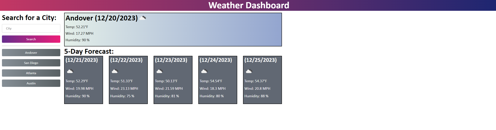

# Weather-Search

## Description
Weather Search is a website designed to input the users desired location and receive info on the locations Name, Date, Temperature, Wind and Humidity.
After searching a location, the website will save it as a button that you can click on to revisit and see the data on the location.
It will also proivide data for the next 5 days

## Link To Deployed Site
[Weather Search](https://akcashing.github.io/Weather-Search/)
